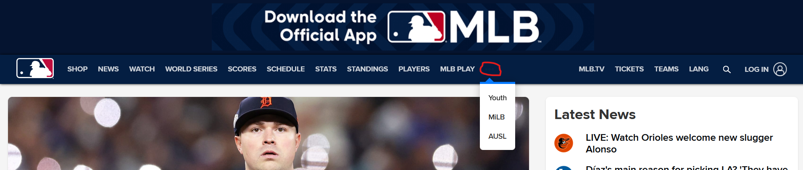
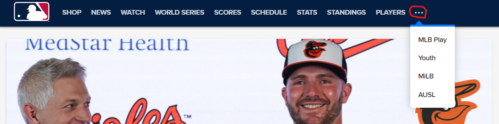

# MLB | Header | Overflow icon lacks visible fill in Firefox (only visible when zoomed)

## Summary
The overflow menu icon (three dots inside a button) exists and is clickable, but in Firefox the dots have no white fill and appear invisible at normal zoom; only when zoomed in can you tell the dots are present but lack color.

## Environment
- Site: https://www.mlb.com
- Mode: Desktop
- Browsers tested: Firefox (issue), Edge (ok), Chrome (ok). Others not tested.
- Component: Header / Navigation bar
- Element: Overflow menu (three-dot icon)

## Preconditions
- Access to MLB.com
- Desktop view
- Header in a collapsed state (navigation compressed into overflow menu)

## Data used
- Site: MLB.com
- Component: Header / Navigation bar
- Element: Overflow menu (three-dot icon)

## Steps to reproduce
1) Open MLB.com in a desktop browser.  
2) Resize or reach a state where navigation collapses into the overflow menu.  
3) Observe the three-dot icon area in Firefox.  
4) (Optional) Zoom in on that area; the dots are present but lack white fill.  
5) Compare with Edge/Chrome where the dots are visible in white.

## Actual result
- Firefox: the overflow menu element is in the DOM and clickable, but the three dots lack white fill; at normal scale they appear absent and the user misses the menu. Only when zoomed in do the unfilled dots become visible.  
- Edge/Chrome: the dots are visible in white (expected behavior).

## Expected result
- The three-dot icon should be visibly rendered (white fill with sufficient contrast) whenever the header collapses options, across all supported browsers.

## Evidence
- Firefox (missing visible fill):   
- Edge (expected behavior): 

## Severity / Impact
- Severity: Medium (usability/discoverability).  
- Impact: Firefox users may miss the overflow menu and lose access to navigation options in collapsed views.

## Technical notes (suggested)
- Review styles on the icon in collapsed states (color/fill/stroke, opacity, z-index).  
- Check contrast against header background and any Firefox-specific rules (prefixes, inheritance).  
- Confirm no pseudo-element/icon is hidden at the relevant breakpoint.  
- Ensure white color/fill is explicitly applied and not reliant on inheritance.

## Recommendations
- Force white color/fill and adequate contrast for the icon in collapsed breakpoints.  
- Add visual/regression test (Playwright or similar) to validate icon rendering across viewports and browsers.  
- Include accessibility check (visible focus/aria-label) for the overflow button.
